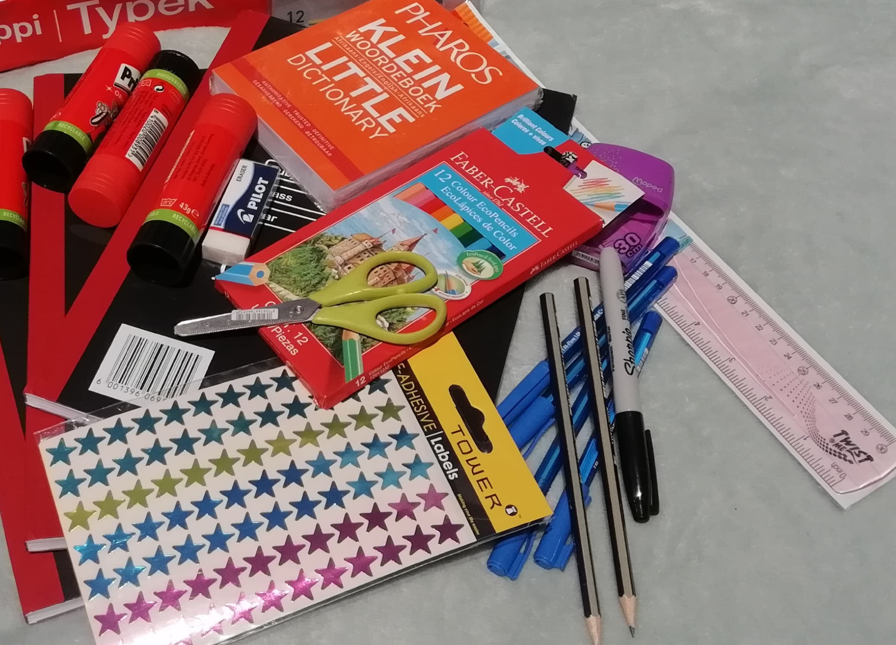
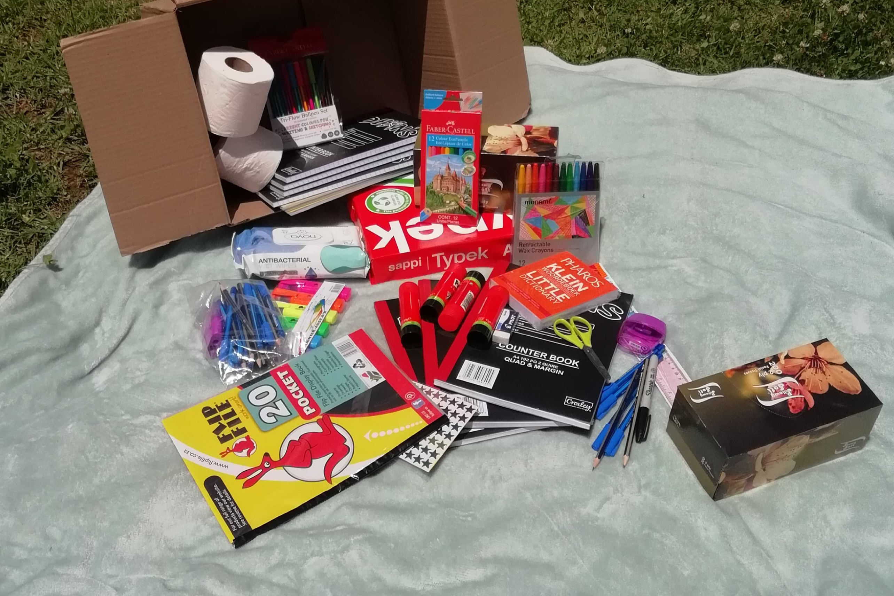
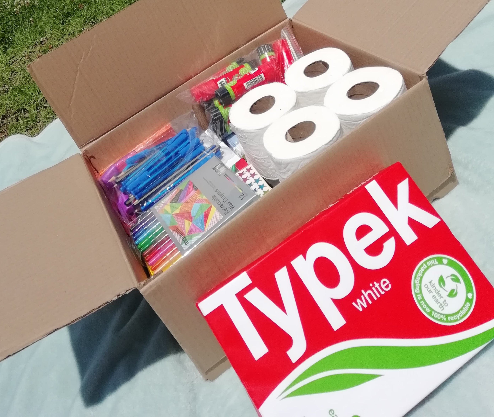
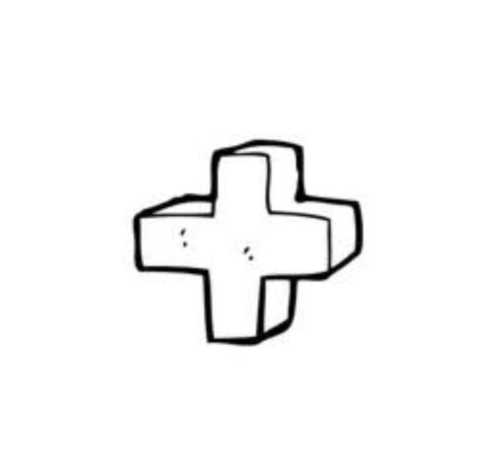

<!DOCTYPE html>
<html lang="en">
<head>
<meta charset="UTF-8" />
<meta name="viewport" content="width=device-width, initial-scale=1.0" />
  <!-- Hamburger Menu Button -->

<!-- Side Menu -->
<nav id="side-menu">
    <a href="index.html">Home</a>
    <a href="#shop">Shop</a>
    <a href="#about">About</a>
    <a href="contact.html">Contact</a>
</nav>

<!-- Google Fonts -->
<link href="https://fonts.googleapis.com/css2?family=Baloo+2:wght@700&display=swap" rel="stylesheet">

</head>

<body>
<header class="top-header">
    
☰

    <h1 class="site-title">Eminent Services</h1>

    
🛒

</header>

<section>
    

    <h2>Affordable Stationery Packs for Parents & Schools</h2> 
    
Quality stationery delivered nationwide.

    

    FOR A CUSTOMIZED STATIONERY PACK, CONTACT US ON
     
    <a href="https://wa.me/27713535297" 
       style="text-decoration: none; display: block; text-align: center; margin-top: 6px;
              font-size: 18px; font-weight: bold;">
        071 3535 297
    </a>

</section>

<section class="products">

<!-- Basic Pack -->

  
    <h3>Basic Pack</h3>
    

        R1999.99
    

    <button class="add-to-cart-btn" 
        onclick="addToCart('Basic Pack', parseFloat(this.closest('.product-card').dataset.price)); event.stopPropagation();">
        Add to Cart
    </button>

    <!-- Standard Pack -->
    

        
         <h3>Standard Pack</h3>

        

            R1999.99
            
        

       <button class="add-to-cart-btn"
       onclick="addToCart('Standard Pack', parseFloat(this.closest('.product-card').dataset.price)); event.stopPropagation();">
         Add to Cart
       </button>
    

    <!-- Deluxe Pack -->
    

        
         <h3>Deluxe Pack</h3>
        
        

            R1999.99
            
            
        

        <button class="add-to-cart-btn"
        onclick="addToCart('Deluxe Pack', parseFloat(this.closest('.product-card').dataset.price)); event.stopPropagation();">
          Add to Cart
          </button>
    

    <!-- Customised Pack-->
    

        
         <h3>Customised Pack</h3>
        
        

            R1999.99
            
        

        <button class="add-to-cart-btn"
        onclick="addToCart('Customised Pack', parseFloat(this.closest('.product-card').dataset.price)); event.stopPropagation();">
          Add to Cart
          </button>
    

</section>

 
    
<strong style="color: black;">We deliver nationwide</strong>

    
Prices may vary based on your custom package details.
 
    
We will provide a personalised quote for your specific needs!!!
 

<!-- CART PANEL -->

    <button onclick="toggleCart()" style="float:right; background:red; color:white; border:none; padding:5px 10px; border-radius:5px; cursor:pointer;">Close ×</button>
    <h3>Your Cart</h3>
    

    <h3>Total: R0.00</h3>
    <button class="checkout-btn" onclick="checkout()">Checkout</button>

<!-- PRODUCT DETAILS MODAL -->

    

        ×
        <h2 id="modal-title"></h2>
        <ul id="modal-items"></ul>
    

<footer>
    © 2025 Eminent Services — All Rights Reserved
</footer>

</body>
<!-- Floating sale banner -->

    Order now while stocks last!!! Sale ends on the 15th of December!!! 

</html>
